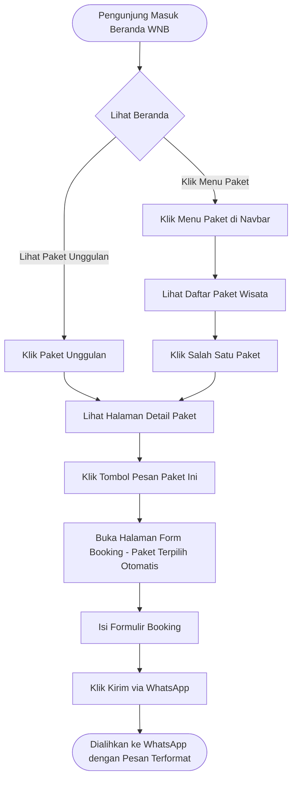
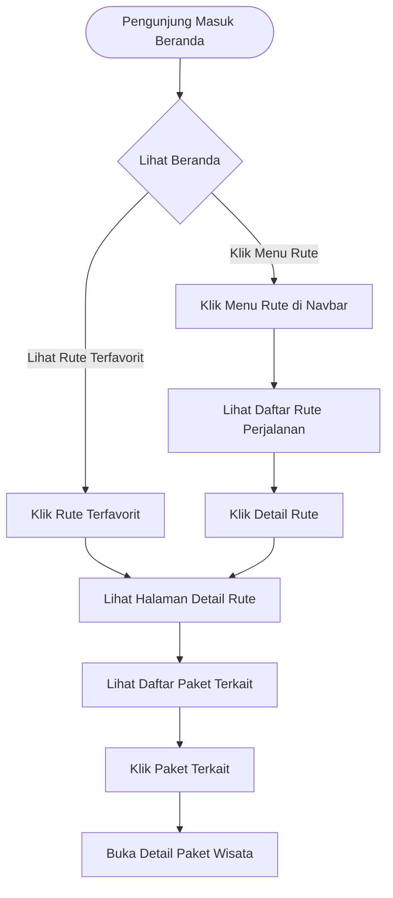
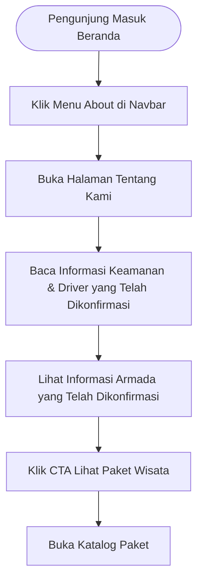
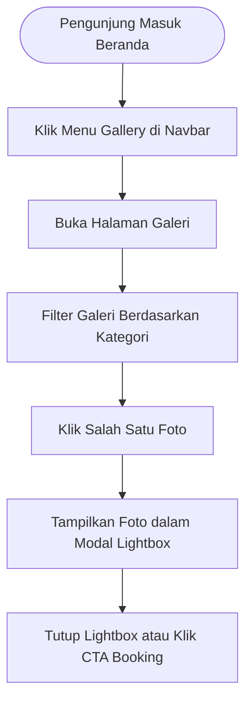

# User Flow Document — WNB

Dokumen ini menjelaskan alur interaksi pengguna (*user flows*) di dalam aplikasi **WNB (Wisata Ngaprak Bandung)** versi MVP menggunakan diagram alur Mermaid beserta penjelasannya.

---

## Flow 1: Menjelajahi dan Memesan Paket Wisata
Alur utama ketika pengunjung datang untuk mencari paket petualangan yang siap dipesan dan menyelesaikannya lewat pemesanan WhatsApp.

### Penjelasan Langkah
1.  **Beranda:** Pengunjung mendarat di `/` dan dapat langsung melihat paket unggulan atau membuka daftar paket lewat menu di navbar.
2.  **Katalog Paket:** Pengunjung membandingkan opsi paket di `/paket`.
3.  **Detail Paket:** Membuka `/paket/:slug` untuk membaca rincian fasilitas *included* dan *excluded*.
4.  **Booking Form:** Mengklik "Pesan Paket Ini" akan membuka `/booking?package=slug` dengan paket yang dimaksud sudah terisi di dropdown formulir.
5.  **WhatsApp Redirection:** Setelah form diisi valid dan tombol dikirim, browser membuka tab baru yang mengarah ke nomor WhatsApp WNB membawa teks pesanan siap kirim.

---

## Flow 2: Menjelajahi Rute Perjalanan
Alur ketika pengunjung tertarik pada lintasan atau lokasi petualangannya terlebih dahulu, baru kemudian mencari paket yang melewati rute tersebut.

### Penjelasan Langkah
1.  **Daftar Rute:** Pengunjung masuk ke `/rute` untuk mengeksplorasi pilihan jalur off-road.
2.  **Detail Rute:** Pengunjung membaca kondisi medan dan tingkat kesulitan jalur di `/rute/:slug`.
3.  **Paket Terkait:** Pada halaman detail rute, sistem menampilkan daftar paket wisata yang menggunakan jalur tersebut. Pengunjung dapat mengklik paket tersebut untuk berpindah ke detail paket dan melanjutkan proses pemesanan.

---

## Flow 3: Membaca Profil WNB (About)
Alur ketika pengunjung ingin membaca informasi profil WNB yang telah dikonfirmasi sebelum melakukan booking.

### Penjelasan Langkah
1.  **Navigasi About:** Pengunjung mengakses `/about` dari navbar.
2.  **Edukasi Keamanan & Armada:** Membaca informasi mengenai keamanan, driver, dan armada yang telah dikonfirmasi oleh pemilik proyek.
3.  **Konversi:** Pengunjung mengklik CTA untuk melihat daftar paket yang siap disewa setelah membaca profil tersebut.

---

## Flow 4: Melihat Galeri Dokumentasi (Gallery)
Alur pencarian bukti visual keseruan kegiatan off-road sebelum memantapkan pilihan.

### Penjelasan Langkah
1.  **Galeri:** Pengunjung mengakses `/gallery`.
2.  **Filtering:** Memilih kategori seperti *Corporate* atau *Offroad* untuk melihat keseruan aktivitas sejenis.
3.  **Lightbox Preview:** Mengklik foto memunculkan modal hitam dengan resolusi foto penuh untuk melihat detail visual tanpa berpindah halaman.
